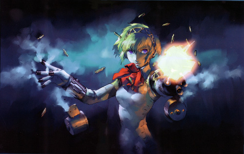

Persona: Aegis or Aigis?
========================

:date:      2012-10-30
:tags:      persona aegis aigis
:category:  Gaming
:author:    Marshall Ward
:lang:      en

Sweating through Persona 3 Portable has turned me into a Persona fan, and one
of the more interesting characters is the Anti-Shadow Suppression Weapon,
Aigis.  But there is one thing I find confusing about her: How do I spell her
name??

Since the character was developed in Japan, perhaps the only official spelling
is the one in Japanese. Unfortunately, it's in kana form: アイギス (aigisu),
which always produces ambiguous romanisation. Still, promotional material comes
to the rescue, revealing the innermost intentions of the content creators, and
presents it as **Aegis**. And the issue would be settled there, except Atlus
USA chose to romanise it as **Aigis**.

But this isn't your typical oblivious romanisation problem. The localisation
staff at Atlus USA managed to skilfully translate these games, which sit
directly within contemporary Japan, and clearly know what they are doing. And
yet the name obviously refers to the `mythical aegis` of ancient Greek and
Mediterranean culture, so why would they choose this alternative form? Well,
it's just another romanisation problem, except this time it's Greek.

In Greek, aegis is written as αἰγίς, which has different romanisations
depending on the form y ou use. If we consult our handy `Greek romanisation
chart` (and ignore the diacritic marks), then we can see that the diphthong
*αι* can be transcribed as either *ae* or *ai*, depending on the format.

So which is correct? While there is no right answer and translation is always a
matter of preference, let's try to see which one is at least the most
consistent with the global community. "Classical" and "Scientific"
romanisations probably represent ad hoc conventions that arose through academic
research, and before notions of international convention even existed, so I'm
going to overlook them and take `ISO 843` as an official romanisation.  In that
case, **aigis** would appear to win out.

But you might argue that it's clearly referring to the Ancient Greek myth of
Zeus' shield, so we should use the classical spelling. Well, I think **aigis**
wins out again in this case, if the Wikipedia article is to be trusted, since
ancient Greek scholars are shifting to ISO 843 and do not romanise the
diphthongs anymore.

Despite all this, you might say that scholastic conventions and
standardisations really don't matter. Decades, if not centuries, of Greek
scholars have been writing "aegis" when they refer to the mythical and
allegorical shields, and that is the popularly accepted spelling. So it is more
correct to write **aegis**, and that's what Atlus USA should have used.

In the end, I think one has to accept that there is no right answer, and that
it's the decision of the localisation staff. If they wanted to call her "Shield
robot lady", then we'd have to live with it. But the interesting conclusion to
me is that **aigis** is completely justifiable, and possibly even acceptable.
It may look like lazy kana romaisation, which is a common problem in any
translated product, but it may have in fact been a very deliberate and
thoughtful decision by some translator. It would be great to ask them about it
someday.

.. _mythical aegis:
    http://en.wikipedia.org/wiki/Aegis

.. _Greek Romanisation Chart:
    http://en.wikipedia.org/wiki/Romanization_of_Greek

.. _ISO 843:
    http://en.wikipedia.org/wiki/ISO_843
